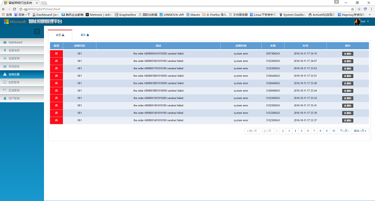

# zhangyang89hi.github.io
个人站点

### 基本信息
---
```
姓名：张洋洋    性别：男    年龄：28    籍贯：河南新蔡

电话：17521087305          邮箱：zhangyang89hi@126.com

求职意向：web前端开发	当前状态：已离职	期望薪资：12K

```
WebSite: [http://116.62.246.187:9000](http://116.62.246.187:9000)

Github：[https://zhangyang89hi.github.io/](https://zhangyang89hi.github.io/)

### 教育经历
---
```
2007.9 - 2011.7    西安邮电大学    光电信息工程    本科  

2012.9 - 2015.7    西安工业大学    光学工程       研究生

大学英语四/六级（CET-4/6），良好的听说读写能力，能快速浏览英语专业文件及书籍
```

### 职业技能
---
+ 熟练掌握HTML/CSS/JavaScript，熟悉HTML5/CSS3/ES6新特性，

+ 掌握jQuery / jQuery UI / Bootstrap 等前端框架的使用和开发

+ 熟练使用Sass 、Gulp、Webpack等预处理/自动化构建工具进行前端工程化开发

+ 熟悉Vue+Vuex及全家桶，了解框架实现原理，并有项目开发经验；

+ 理解Web,W3C标准 掌握基本的前端兼容性处理、跨浏览器适配，性能优化知识与技巧

+ 熟悉Linux操作，了解Node.js、Express框架

### 工作经历/项目经历
---
2015.08 - 2016.2          郑州安控科技有限公司            嵌入式软件开发
>基于51，STM32系列单片机系统的嵌入式软件设计、开发和测试工作

2016.05 - 2017.12          上海恒兆节能科技有限公司            软件开发工程师
>1. 公司网站建设和维护
>2. 配合架构师完成智能照明系统前端页面的开发工作
>3. 对照明控制系统进行调试，维护

基于ZigBee的无线照明web控制系统
项目描述：利用ZigBee无线通讯技术，对灯具进行远程管理，web前端采用Vue框架，使用了jQuery / ECharts / Bootstrap，该系统具有硬件管理、参数配置、灯具控制、场景控制、能耗展示、系统报告等功能
担任角色：在架构师的带领下，负责完成页面的开发、调试和适配工作，并根据项目中的使用情况进行调整和修改

### 自我评价
---
具有良好的编程习惯和较强的的学习能力，良好的沟通能力，有团队合作精神和责任感，能够勇于承担重任。关注前端技术发展，喜欢研究新技术，熟悉web项目开发流程。

<!--




-->
